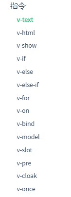

# vue自定义指令&生命周期

## 一、自定义指令

### 1.内置指令

+ vue内置指令都有啥:



+ 自定义指令干啥用:在 Vue2.0 中，代码复用和抽象的主要形式是组件。然而，有的情况下，你仍然需要对普通 DOM 元素进行底层操作，这时候就会用到自定义指令。

### 2.例子

+ code: ./6.directive.html

```html
    <div id="app">
        <input type="text" v-focus>
    </div>
    <script src="vue.js"></script>
    <script>
    Vue.directive("focus",{
            inserted(el){
                el.focus();                
            }
        })
    var vm=new Vue({
        el:"#app",
        data:{

        }
    })
    </script>
```

### 3.钩子函数

一个指令定义对象可以提供如下几个钩子函数 (均为可选)：

- `bind`：只调用一次，指令第一次绑定到元素时调用。在这里可以进行一次性的初始化设置。
- `inserted`：被绑定元素插入父节点时调用 (仅保证父节点存在，但不一定已被插入文档中)。
- `update`：所在组件的 VNode 更新时调用，**但是可能发生在其子 VNode 更新之前**。指令的值可能发生了改变，也可能没有。但是你可以通过比较更新前后的值来忽略不必要的模板更新 (详细的钩子函数参数见下)。

- `componentUpdated`：指令所在组件的 VNode **及其子 VNode** 全部更新后调用。
- `unbind`：只调用一次，指令与元素解绑时调用

### 4.钩子函数参数

指令钩子函数会被传入以下参数：

- `el`：指令所绑定的元素，可以用来直接操作 DOM(实体DOM元素) 。

- binding：一个对象，包含以下属性：

  - `name`：指令名，不包括 `v-` 前缀。
  - `value`：指令的绑定值，例如：`v-my-directive="1 + 1"` 中，绑定值为 `2`。
  - `oldValue`：指令绑定的前一个值，仅在 `update` 和 `componentUpdated` 钩子中可用。无论值是否改变都可用。
  - `expression`：字符串形式的指令表达式。例如 `v-my-directive="1 + 1"`中，表达式为 `"1 + 1"`。
  - `arg`：传给指令的参数，可选。例如 `v-my-directive:foo` 中，参数为 `"foo"`。
  - `modifiers`：一个包含修饰符的对象。例如：`v-my-directive.foo.bar` 中，修饰符对象为 `{ foo: true, bar: true }`。

- `vnode`：Vue 编译生成的虚拟节点。移步 [VNode API](https://cn.vuejs.org/v2/api/#VNode-接口) 来了解更多详情。

- `oldVnode`：上一个虚拟节点，仅在 `update` 和 `componentUpdated` 钩子中可用。

### 5.简写

在很多时候，你可能想在 `bind` 和 `update` 时触发相同行为，而不关心其它的钩子。比如这样写:

```javascript
Vue.directive('color-swatch', function (el, binding) {
  el.style.backgroundColor = binding.value
})
```

---

## 二、生命周期

### 1. 图解


### 2.例子

+ code:./7.lifecycle.html

```html
    <div id="app">

        <div id="msg">
            {{msg}}
        </div>
        <button @click="msg='haha'">button</button>
    </div>
    <script src="vue.js"></script>
    <script>
        var vm = new Vue({
            el: "#app",
            data: {
                msg: "hello"
            },
            methods: {
                getMsg() {
                    console.log(this.msg);
                }
            },
            beforeCreate() {
                console.log("*********beforeCreate**********");
                console.log(this.msg);
                this.getMsg();
                console.log(document.querySelector("#msg").innerText);
            },
            created() {
                console.log("*********created**********");
                console.log(this.msg);
                this.getMsg();
                console.log(document.querySelector("#msg").innerText);
            },
            beforeMount() {
                console.log("*********beforeMount**********");
                console.log(this.msg);
                this.getMsg();
                console.log(document.querySelector("#msg").innerText);
            },
            mounted() {
                console.log("*********mounted**********");
                console.log(this.msg);
                this.getMsg();
                console.log(document.querySelector("#msg").innerText);
            },
            beforeUpdate() {
                console.log("*********beforeUpdate**********");
                console.log(document.querySelector("#msg").innerText);
            },
            updated(){
                console.log("*********updated**********");
                console.log(document.querySelector("#msg").innerText);
            }
        })
    </script>
```

